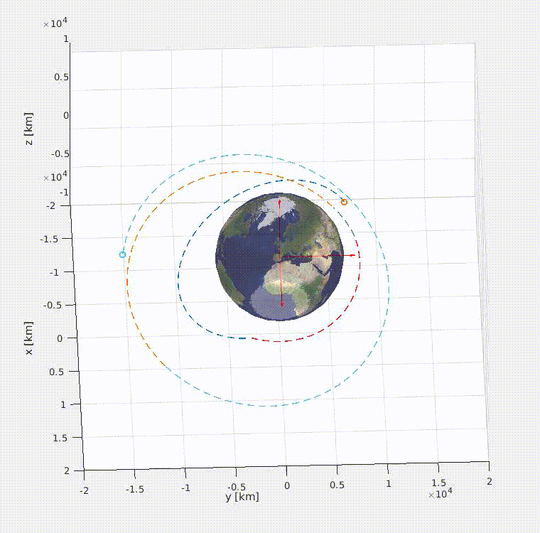

# OrbitalTransfer
A simulation of an __orbital tranfer__ for a satellite around Earth. The initial and final orbits are given. Through orbital mechanics, it is possible to compute the optimal transfer for the satellite.\
In this repository, you will find the MATLAB code needed for the simulation.\
\

